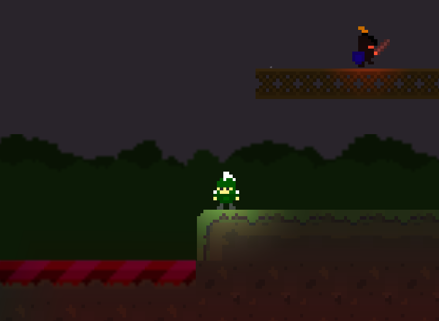

# StormySparty-UnityGame
It's an verticle slice of an 2D Platformer with all the assets included for full game build.
It supports the 2D lights of unity making it's environment unique and immersive as the stormy whether with raining created with particle effects give this an amazing experience.

The game mechanics are highly adjustable for easy customization as Begineers/Non-programmers also can create there game from the scratch and can customize there world/levels.

Current game supports multiplatform controls like Keyboard/joystick/ Xbox Controller 

Some Screenshots:

